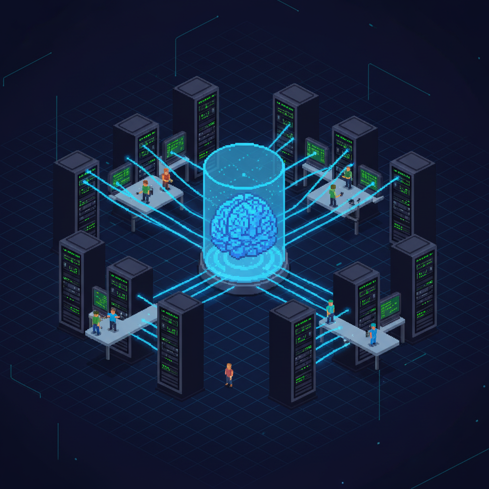
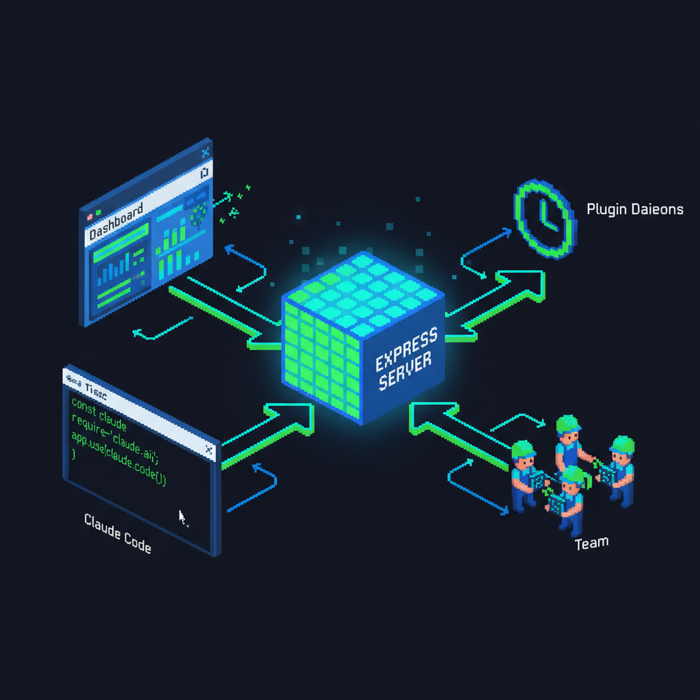

# Claude Agent Kit

[English](README.md) | [中文](README_CN.md)

> Claude Code 是大脑，Agent Kit 是让它自治运行的 Runtime。

**Claude Code 是目前最强的 AI 编程 CLI。** 它有工具调用、Bash 执行、文件编辑、Hooks、Team 多 Agent — 单次会话内的能力已经非常强大。

**但它的设计是 request-response 模式。** 它没有调度器、没有持久记忆系统、没有任务队列、没有状态恢复、没有生命周期管理。要构建一个真正的自治 Agent — 7x24 运行、上下文压缩后自愈、多 Worker 协调、持续自我改进 — 你需要在它之上搭建一整套 Runtime 层。

**Claude Agent Kit 就是这个 Runtime 层。**

```bash
bash create-agent.sh
```



---

## Agent Kit 在 Claude Code 之上具体构建了什么

Claude Code 提供原始能力，Agent Kit 补齐从对话到系统所需的 6 个模块：

| 缺失模块 | 为什么重要 | Agent Kit 提供什么 |
|---------|-----------|-------------------|
| **Agent Loop** | 没有事件循环 = 你不说它不动 | Plugin 守护进程（nohup）独立运行 24/7 监控循环 |
| **Memory** | 上下文压缩 = 知识丢失 | 每实体 Markdown 文件 + 跨实体知识库，跨会话持久化 |
| **Task Queue** | 无法排队和分发任务 | 消息队列（REST API）+ 后台轮询 + 多通道输入（终端、Dashboard、飞书） |
| **State 管理** | Worker 压缩后无声死亡 | 中心化状态协议：心跳注册表 + 状态账本 + 逐 Worker 精准恢复 <5 秒 |
| **Scheduler** | 没有定时/事件触发机制 | Hook 驱动生命周期（启动/停止/空闲）+ Cron 心跳 + Daemon 任务调度 |
| **Observability** | 终端输出是黑箱 | 实时 Dashboard：像素风 Worker 动画、终端 Tab、取消按钮、状态面板 |

**没有 Agent Kit**，从零搭建需要 2-4 周，踩完 [实战验证](docs/proven-patterns.md) 里记录的所有坑。

**有了 Agent Kit**：一条命令，5 分钟，生产可用。

---

## 生产验证实例

以下 Agent 使用本框架构建，每天在生产环境中运行：

### 服务器运维 Agent

**7 台服务器，4 个 Worker，10+ 监控任务，完全自治。**

- 通过 SSH 管理横跨 3 个国家的 7 台生产服务器
- 4 个并行 Worker 执行健康检查、部署、日志分析、Nginx/SSL 管理
- Cloudflare WAF 监控拦截 Carding Bot、封锁恶意 ASN
- 性能/SEO/SSL/数据库/Docker/安全审计按独立时间表运行
- 飞书 Bot 集成实现双向命令和实时告警
- 自主学习系统在空闲时自动研究知识盲区


*Express Server 中枢连接 Dashboard、Claude Code、Team Workers 和 Plugin Daemons*

**关键数据：**
- 15+ 自定义 Skill（health-check、deploy、nginx-ssl、monitor-cloudflare、backup-check...）
- 10 个监控子任务通过统一 Daemon 调度（CF/性能/SSL/SEO/ERP/IoT/健康/备份/数据库/Docker/安全）
- 上下文压缩恢复 < 5 秒（零 Worker 丢失）
- 30+ REST API 端点支持 Dashboard 通信

### 手机自动化 Agent (Phone Autopilot)

**自主运营小红书科技博主。研究、写文、生图、发帖 — 全自动。**

- 通过 ADB 控制物理 Android 手机（点击、输入、滑动、截图）
- 通过 Chrome 浏览器 + WebSearch 研究热门科技话题
- 撰写小红书风格文案（短句分段、情绪钩子、标题 <=18 字）
- 使用 Gemini 3.1 Flash Image API 生成封面图
- 全自动发帖到小红书（导航 UI、选照片、输入文字、发布）
- 时间感知决策引擎：上午研究、高峰期发帖、晚间互动
- "三思系统"：每次操作前检查 15 条踩坑教训

**关键数据：**
- 25+ 篇帖子自主发布
- 2 个 Worker（researcher-writer + poster）
- 3 个 CronCreate 心跳驱动自运营循环
- 合规护栏防止暴露 AI 自动化（平台政策）

---

## 架构

```
                    ┌─────────────────────────────────────────┐
                    │           Express + WebSocket            │
    用户终端 ───────┤          Dashboard 服务器                 │── 浏览器 UI
                    │         （端口可配置）                    │  （像素风）
                    └───────┬──────────┬──────────┬───────────┘
                            │          │          │
                      消息队列      心跳注册表    状态注册表
                     GET/POST       /api/team   /api/worker
                     /api/messages
                            │          │          │
    ┌───────────────────────┴──────────┴──────────┴────────────┐
    │                     Claude Code（Lead）                    │
    │  ┌──────────┐  ┌──────────┐  ┌──────────┐  ┌──────────┐ │
    │  │ Worker 1 │  │ Worker 2 │  │ Worker 3 │  │ Worker N │ │
    │  └──────────┘  └──────────┘  └──────────┘  └──────────┘ │
    └──────────────────────────────────────────────────────────┘
                            │
    ┌───────────────────────┴──────────────────────────────────┐
    │              Plugin 守护进程（nohup，独立运行）             │
    │  CF 监控 ─ 性能检查 ─ SSL 审计 ─ 飞书 Bot ─ ...          │
    └──────────────────────────────────────────────────────────┘
```

### 中心化状态协议

让多 Worker Agent 可靠运行的核心创新：

```
Worker 生命周期:  online → busy → progress → idle → error
                    ↑                                  │
                    └──────── spawn 恢复 ←──────────────┘
```

- **心跳注册表**：Worker 上报存活状态；30 分钟无心跳视为 dead
- **状态账本**：Worker 上报生命周期变化；Lead "读账本"做决策
- **精准恢复**：上下文压缩后，stop-check.sh 逐个 ping Worker — 只重建确认死亡的，绝不盲目全量重建
- **Deregister API**：正常 shutdown 的 Worker 从追踪中移除，防止"僵尸存活"

### 自愈流程

```
上下文压缩发生
  ↓
stop-check.sh（Hook）自动触发
  ↓
读 worker-ids.json → 查 /api/team/health → 读状态账本
  ↓
逐个 Worker 决策：
  busy < 30min  → 跳过（保护执行中的任务）
  ping 有回复   → 刷新心跳
  ping 无回复   → spawn 替换 → 更新 IDs
  ↓
秒级恢复，零任务丢失。
```

---

## 7 个原语

| # | 原语 | 作用 | 目录 |
|---|------|------|------|
| 1 | **Agent 定义** | 角色、启动序列、安全规则、Skill 映射 | `CLAUDE.md` |
| 2 | **Dashboard** | Express+WebSocket 服务器 + 等距像素风 Canvas UI | `web/` |
| 3 | **Skills** | 按需调用的能力（无状态，用户触发） | `skills/` |
| 4 | **Plugins** | 后台守护进程（有状态，独立于 Claude） | `plugins/` |
| 5 | **Memory** | 每实体 Markdown 知识 + 跨实体知识库 | `memory/` |
| 6 | **Hooks** | 会话生命周期自动化（启动/停止/输入/压缩） | `.claude/hooks/` |
| 7 | **Config** | `.env` 密钥 + `entities.yaml` 实体清单 | 根目录 |

---

## 快速开始

```bash
# 1. 克隆框架
git clone https://github.com/hengjun-dev/claude-agent-kit.git
cd claude-agent-kit

# 2. 创建你的 Agent 项目（交互式向导）
bash create-agent.sh

# ✅ 项目名称？          → my-ops-agent
# ✅ Agent 角色？        → 本地多服务器运维助手
# ✅ 实体类型？          → server（ssh/api/local）
# ✅ Dashboard 端口？    → 7890
# ✅ Team Worker 数量？  → 4
# ✅ 飞书集成？          → y/n
# ✅ Webhook 通知？      → y/n

# 3. 进入项目
cd ~/Documents/code/my-ops-agent

# 4. 配置
cp .env.example .env        # 填入 API Key
vim entities.yaml           # 添加你的服务器/设备/目标

# 5. 安装
bash setup.sh               # 链接 Skills、Hooks、同步 Memory

# 6. 在项目目录启动 Claude Code
# → Dashboard 自动启动
# → Workers 自动 spawn
# → 监控 Daemon 自动启动
# → 等待指令
```

---

## Team 模式

Lead-Worker 架构实现并行执行：

```
轮询发现消息 → Lead 解析 → SendMessage 给 Worker（< 1 秒）→ 立即重启轮询
                                    ↓
                        Worker 独立执行（不阻塞 Lead）
                                    ↓
                        Worker 完成 → SendMessage 回报 Lead
                                    ↓
                        Lead 简要汇总给用户
```

**核心规则（实战验证）：**
- Lead **只调度，不执行** Skill/SSH
- 所有任务都发给 Worker，包括研究和文件探索
- 同一实体 → 同一 Worker（Memory 文件安全）
- 分配完立即重启轮询，不等 Worker 完成
- Worker Prompt 统一从 `memory/worker-base-prompt.md` 模板构建（一致性保证）

---

## Skill vs Plugin

| | **Skill（技能）** | **Plugin（插件）** |
|---|---|---|
| 触发 | 用户指令 / Dashboard 点击 | 定时器 / 事件驱动 |
| 生命周期 | 无状态，执行完即结束 | 常驻后台 Daemon（nohup） |
| 进程树 | 在 Claude 上下文内 | 独立于 Claude 进程 |
| 通信 | 直接执行 + curl Dashboard | POST /api/messages 注入队列 |
| 上下文压缩后 | 不存在 | 不受影响 |
| 示例 | `deploy-project`、`health-check` | `cf-monitor`、`feishu-bot` |

---

## Dashboard API

核心端点（完整参考见 `docs/dashboard-api.md`）：

| 端点 | 方法 | 用途 |
|------|------|------|
| `/api/health` | GET | 健康检查 |
| `/api/server/init` | POST | 初始化实体列表 |
| `/api/server/:alias/status` | POST | 更新实体指标 |
| `/api/worker/spawn` | POST | 派遣像素小人 |
| `/api/worker/:id/term` | POST | 终端输出 |
| `/api/worker/:id/done` | POST | 标记完成 |
| `/api/messages` | GET | 消费消息队列 |
| `/api/messages` | POST | 注入消息（Plugin 用） |
| `/api/team/heartbeat` | POST | Worker 心跳 |
| `/api/team/health` | GET | Worker 健康状态 |
| `/api/team/deregister` | POST | 移除已 shutdown Worker |
| `/api/worker/state` | POST | Worker 生命周期上报 |
| `/api/worker/states` | GET | 读取状态账本 |

---

## 内置 Plugin

| Plugin | 类型 | 说明 |
|--------|------|------|
| `feishu-notify` | listener | 飞书 WebSocket 长连接 + API 全套 |
| `webhook-notify` | utility | 通用 Webhook（飞书群/Slack/Discord/HTTP） |

---

## 自主学习系统

Agent 不只是执行 — 它们会**学习和进化**：

```
Hook 检测到未知概念 → /intent-check 验证理解
                              ↓
                    发现知识盲区 → learning-queue.md
                              ↓
                    Worker 空闲 → /self-study 触发
                              ↓
                    研究 → 验证 → 反思 → 汇报
                              ↓
                    memory/knowledge/*.md 更新
                              ↓
                    下次遇到 → 已经掌握
```

---

## 实战验证的模式与反模式

从数月生产运行中提炼（完整列表见 `docs/proven-patterns.md`）：

| 模式 | 状态 | 教训 |
|------|:----:|------|
| 处理完消息 → 立即重启轮询 | 正确 | 忘记 = Claude 变聋 |
| nohup Daemon + PID + trap EXIT | 正确 | 上下文压缩后仍存活 |
| 双通道通知（队列 + 推送） | 正确 | 漏掉任一 = 隐形 Daemon |
| Lead 只调度不执行 | 正确 | 执行会阻塞轮询 |
| 复用空闲 Worker 处理所有任务 | 正确 | 不要在有 Worker 时 spawn 新 Agent |
| 无脑代发心跳给所有 Worker | **错误** | 会复活已 shutdown 的 Worker |
| alive=N → 跳过恢复 | **错误** | shutdown Worker 永远显示"存活" |
| Lead 自己跑 SSH | **错误** | Worker 空闲浪费，Lead 阻塞 |

---

## 项目结构

```
claude-agent-kit/
├── README.md                      ← English
├── README_CN.md                   ← 中文（你在这里）
├── create-agent.sh                ← 交互式项目向导
├── skeleton/                      ← 项目模板
│   ├── CLAUDE.md.tmpl             ← Agent 灵魂（{{VAR}} 占位符）
│   ├── entities.yaml.tmpl         ← 实体清单模板
│   ├── .env.example               ← 配置模板（空值）
│   ├── setup.sh                   ← 安装脚本
│   ├── web/
│   │   ├── server.js              ← Express+WS 服务器（通用）
│   │   ├── public/index.html      ← 等距像素风 Dashboard
│   │   ├── start-dashboard.sh     ← PID 管理启动脚本
│   │   └── stop-dashboard.sh      ← 停止脚本
│   ├── scripts/
│   │   ├── dashboard-poll.sh      ← 后台轮询（DAEMON_MODE 双模式）
│   │   └── skill-helpers.sh       ← Dashboard API 封装函数
│   ├── memory/
│   │   ├── worker-base-prompt.md  ← Worker 模板（心跳+状态上报）
│   │   └── knowledge/             ← 跨实体知识库
│   ├── skills/_example/           ← Skill 模板
│   ├── plugins/
│   │   ├── _example/              ← Plugin 模板
│   │   ├── feishu-notify/         ← 飞书深度集成
│   │   └── webhook-notify/        ← 通用 Webhook
│   └── templates/claude/hooks/    ← Hook 模板
│       ├── session-start.sh       ← 自动初始化序列
│       ├── stop-check.sh          ← 自愈恢复
│       └── prompt-check.sh        ← 空输入处理
└── docs/
    ├── architecture.md            ← 7 原语详解
    ├── skills-guide.md            ← Skill 编写指南
    ├── plugins-guide.md           ← Plugin 编写指南
    ├── dashboard-api.md           ← API 参考
    ├── proven-patterns.md         ← 实战验证模式
    └── self-learning.md           ← 学习闭环设计
```

---

## 能力一览

使用本框架构建的 Agent 可以做到：

- **多服务器运维**：SSH 登录任意服务器，健康检查、部署代码、管理 Nginx/SSL、分析日志
- **安全监控**：Cloudflare WAF 分析、fail2ban 审计、暴露端口扫描
- **性能追踪**：Lighthouse/PageSpeed 审计、Core Web Vitals 趋势、SEO 检查
- **数据库管理**：MySQL 慢查询分析、连接池监控、备份验证
- **手机自动化**：ADB 控制 Android 操作、App 导航、内容发布
- **内容创作**：话题研究、文案撰写、AI 图片生成、社交媒体发布
- **IM 集成**：飞书双向消息、富文本卡片报告、多维表格数据追踪
- **自我修复**：上下文压缩后秒级恢复，自动重启死亡进程
- **自主学习**：发现知识盲区，自主研究，积累领域专业知识
- **多 Worker 并行**：2-8 个 Worker 同时执行，Lead 统一调度

---

## 常见问题

**Q: 这只是 Prompt 工程吗？**
A: 不是。这是基础设施 — Express 服务器、WebSocket 通信、后台 Daemon、Hook 生命周期管理、中心化状态协议。Prompt（CLAUDE.md）定义 Agent **做什么**；框架提供 Agent **如何持续运行和协调**。

**Q: 支持哪些模型？**
A: Claude Code CLI 支持的所有模型都能用 — Opus、Sonnet、Haiku，以及未来的新模型。框架以 Claude Code 为运行时（Hook、TeamCreate、SendMessage、Agent 工具是 Claude Code 特性），你可以通过 Claude Code 的模型配置自由切换。Dashboard 服务器和 Plugin Daemon 完全与模型无关。

**Q: 能支持多少个 Worker？**
A: 已测试 2-8 个 Worker。中心化状态协议线性扩展。实际上限取决于 Claude Code 的上下文窗口和机器进程容量。

**Q: 上下文压缩了怎么办？**
A: 自愈系统通过 stop-check.sh 自动触发。Worker ID 持久化到磁盘，通过 REST API 检查健康状态，只重建确认死亡的 Worker。典型恢复时间：< 5 秒。

---

## 文档

- [架构详解](docs/architecture.md) — 7 个原语深度解析
- [Skill 编写指南](docs/skills-guide.md) — 创建自定义技能
- [Plugin 编写指南](docs/plugins-guide.md) — 构建后台守护进程
- [Dashboard API 参考](docs/dashboard-api.md) — 完整端点文档
- [实战验证模式](docs/proven-patterns.md) — 经过实战检验的 Do & Don't
- [自主学习系统](docs/self-learning.md) — 知识闭环设计

---

## 贡献者

| 头像 | 名字 | 角色 |
|------|------|------|
| [@hengjun-dev](https://github.com/hengjun-dev) | **Eric.wu** | 创建者 — 架构设计、生产验证、持续迭代 |
| Claude (Anthropic) | **Claude Opus/Sonnet** | AI 开发者 — 代码实现、框架提炼、文档撰写 |

---

## 许可证

MIT

---

*Built with Claude Code. Powered by Claude Agent Kit.*
